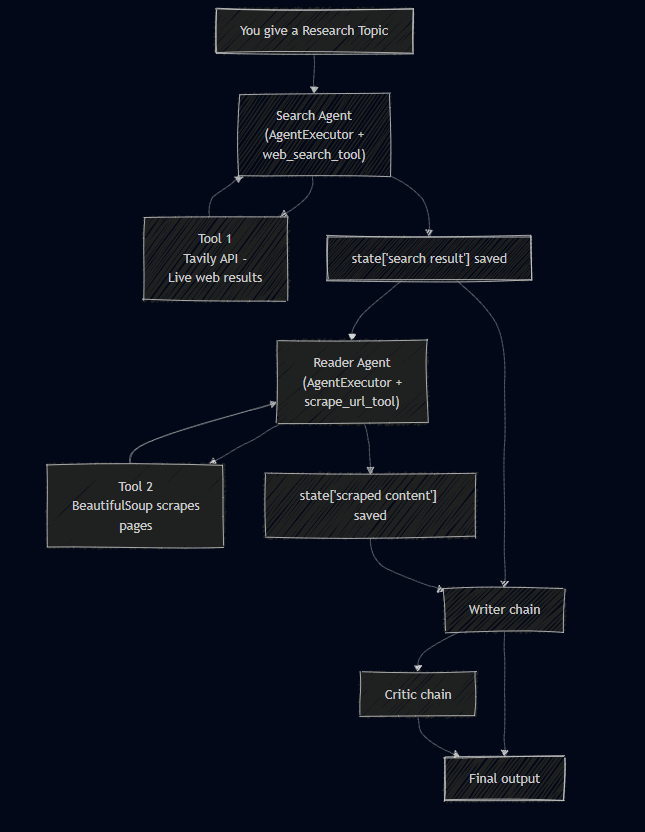

# ResearchMesh - Multi-Agent System

A simple research pipeline that searches the web, scrapes one source, writes a report, and critiques the result.

## Flow

1. Search agent uses the web search tool to fetch recent sources.
2. Reader agent selects one URL and scrapes it for deeper content.
3. Writer chain produces a structured research report.
4. Critic chain reviews the report and provides feedback.



## Core Components

- [tools.py](tools.py): `web_search` (Tavily) and `scrape_url` (requests + BeautifulSoup).
- [agents.py](agents.py): LLM setup, search/reader agents, writer and critic chains.
- [pipeline.py](pipeline.py): Orchestrates the end-to-end workflow and prints outputs.

## How It Works

- The pipeline calls the search agent, which should return raw results with titles, URLs, and snippets.
- The reader agent picks a relevant URL and scrapes it.
- The writer combines search results and scraped content into a report.
- The critic evaluates the report quality and gaps.

## How To Use

1. Install dependencies.
2. Create a `.env` file with:
   - `TAVILY_API_KEY`
   - `OPENROUTER_API_KEY`
3. Run:
   ```bash
   python pipeline.py
   ```
4. Enter a research topic when prompted.

## Problems Faced

### Search Agent Returning Summaries Instead of URLs

**Problem:**  
The whole decision making is decided by LLM which sometimes returned summarized content itself instead of calling search agents , causing the reader agent to fail scraping and the final report to miss sources.

**Root Cause:**  
`create_agent()` allows the LLM to decide tool behavior.  
Although the `web_search` tool returned URLs correctly individually, the agent sometimes summarized results instead of preserving links.

**Solution:**

- Improved prompting with stricter URL-return instructions
- Switched to a more capable agentic/tool-calling model:

```python
model = "openai/gpt-oss-120b:free"
```
